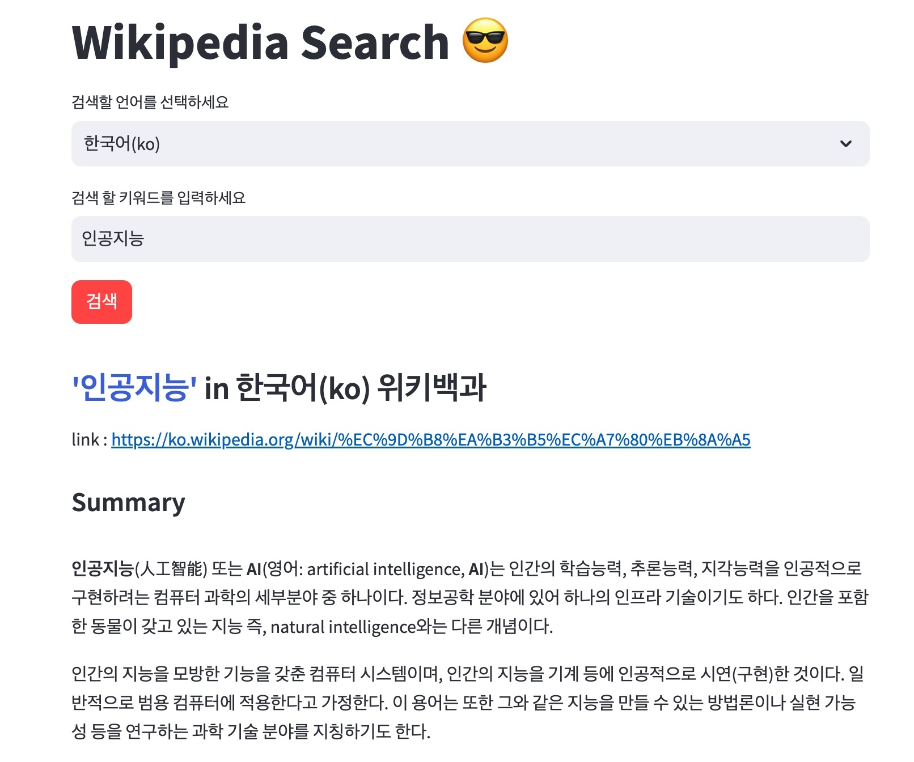
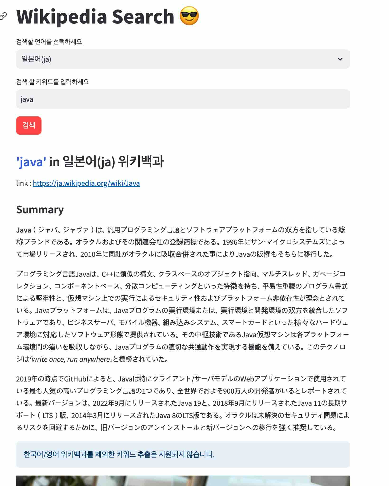
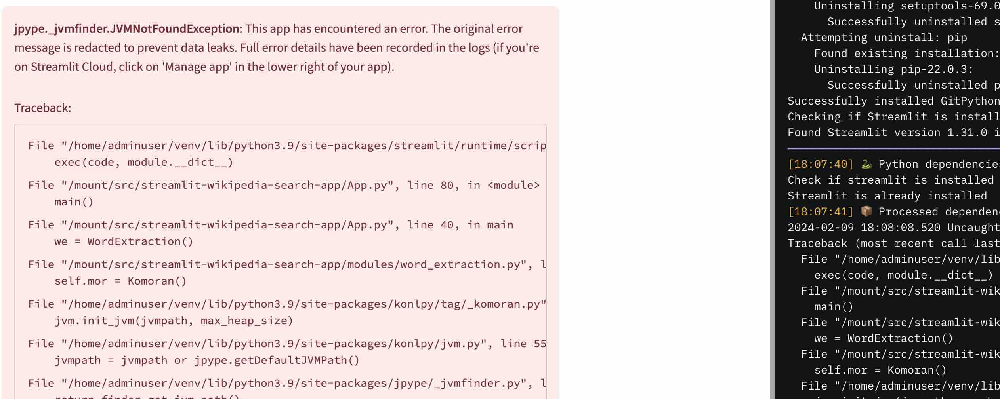
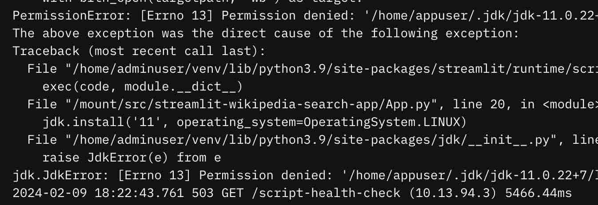

# Streamlit Wikipedia Search App
> 위키백과사전(wikipedia)를 간단하게 검색하고 본문에서 키워드를 추출해 워드클라우드 형태로 시각화 해주는 서비스입니

## DEMO다

> https://easywiki.streamlit.app/

+ wikipedia search



+ keyword extraction
 

  



## ISSUE

> Streamlit Share 에 배포하게 되면 konlpy가 JAVA 런타임이 필요해서 오류가 발생



+ 아래처럼 코드를 심어서 서버에서 JDK 를 설치되도록 시도해보았으나 권한 문제로 실패.

```python
import jdk
import os
from jdk.enums import OperatingSystem, Architecture
jdk.install('11', operating_system=OperatingSystem.LINUX)
jdk_version = 'jdk-11.0.19+7'
os.environ['JAVA_HOME'] = '/root/.jdk/{jdk_version}'
os.environ['PATH'] = f"{os.environ.get('PATH')}:{os.environ.get('JAVA_HOME')}/bin"
```



### 해결방법

> 프로젝트 루트경로에 packages.txt 파일을 만들고 default-jre 입력 > 해결됨